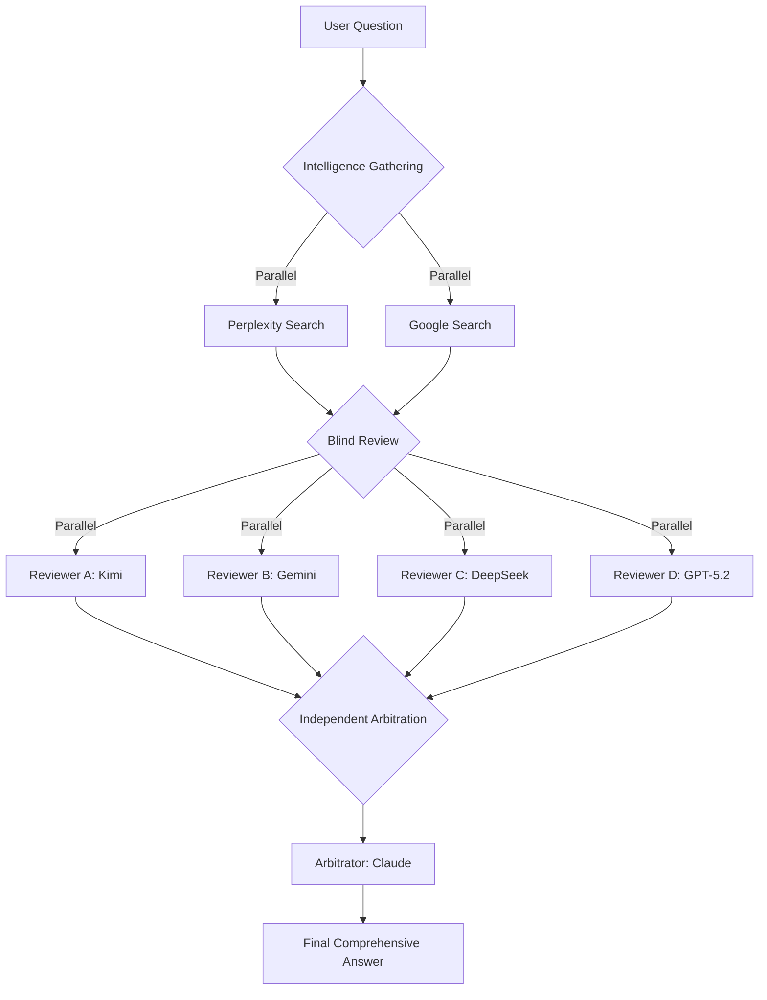

# Ensemble Jury - 盲审委员会

> 多模型盲审 + 情报收集 + 最终裁决系统

## Overview

A multi-model ensemble system that employs a "blind review" mechanism similar to academic peer review. It gathers intelligence, solicits independent answers from multiple top-tier models, and then uses a separate arbitrator (Claude) to synthesize a final, unbiased, comprehensive answer.

**Key Mechanism**:
1.  **Intelligence Gathering**: Fetches real-time data via Perplexity & Google Search.
2.  **Blind Review**: Four "reviewers" (Kimi, Gemini Pro, DeepSeek Reasoner, GPT-5.2) answer independently without knowing each other's existence.
3.  **Independent Arbitration**: Claude Sonnet 4.6 acts as the neutral judge, reading anonymized answers + search results to produce the final verdict.

## Activation

Use when the user explicitly asks for:
- `ensemble <question>`
- `multi-model <question>`
- `综合 <question>`
- `盲审 <question>`
- `jury <question>`
- `committee review <question>`

Or when the user needs a deeply researched, multi-perspective answer to a complex question.

## Workflow



## Requirements

- **Node.js**: Runtime environment.
- **Skills**: `perplexity-safe`, `google-search` must be installed and configured.
- **Models**: Access to `kimi`, `gemini`, `deepseek`, `gpt-5.2` and `claude` agents.

## Usage

```bash
# Run the ensemble process
node scripts/ensemble.mjs "Your question here"
```

## Anti-Patterns

❌ **Do NOT use for**:
- Simple factual queries (use Google Search directly).
- Code generation tasks (use specific coding agents).
- Quick conversational responses.

✅ **Use for**:
- Complex analysis (e.g., market trends, political situations).
- Synthesizing diverse viewpoints.
- Topics requiring high accuracy and neutrality.
